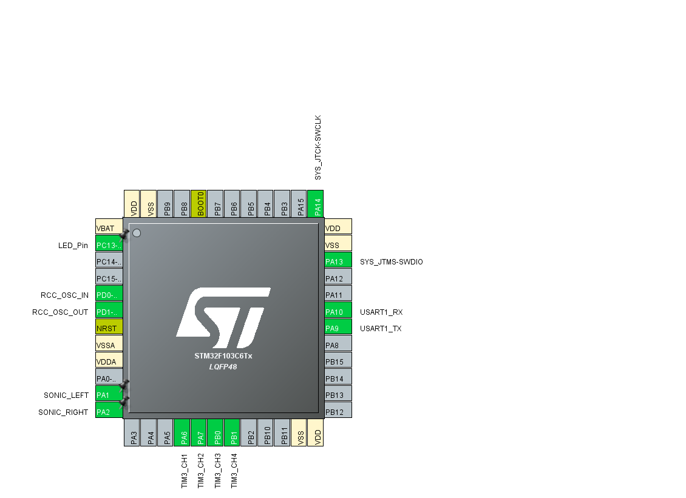

# Ultrasonic_following_car #
上海交通大学IEEE及ai专业电子电路实验课程的大作业选题之一。由于是新加入的项目，难度较大，且与课程教授知识相去甚远，没有电子制作经验的同学可能比较难以完成，特此留下基于stm32的控制代码以供学弟学妹参考。
## 0. 写在前面 ##
此项目由李森、陆晟宇、汪昊阳（拼音顺序）小组制作完成，所有版权归此三人所有。作为开源项目，欢迎各位对代码进行指正或修改，也欢迎大家和作者联系交流。当然，更希望这份代码，或者说这套解决方案，可以帮助到学弟学妹们。但是，我们并不鼓励学弟学妹们直接照抄这套方案，应付老师，更加不希望这套方案限制了大家的思路。提供这套方案只是为了让大家有一个基本思路，不至于一头雾水地做项目。做项目是一件非常能够带来成就感和满足感的事情，希望大家能广阔地发挥思路，享受上大学以来第一个比较正式的项目。
## 1. 硬件基本说明 ##
### (a) 实验耗材 ###
面包板*2(发射端和接收端各一块)、超声小车组件一套(两轮驱动小车车架、电机驱动模块、驱动马达等)、超声探头*3、stm32f103c8t6系统板*2、导线电池若干。
在系统板选择上，由于单片机功能太过低级，而FPGA板开发效率过于低下（指开发时的体验），我们选用了功能更加强大的stm32系统板。
### (b) 小车框架搭建 ###
在小车框架搭建布局上，我们采用简洁稳定为主要标准，力求将排线做到条理有序，整个小车外观简洁，无多余负载，造型美观。
在项目设计阶段，我们选择采用双探头接受模式，因此选择舍弃小车上方盖板，将接收端电路面包板竖立与小车行驶方向前端，将电池盒及电机驱动模块粘于第一层车架内部，既平衡重心，又使供电系统收到保护，保障稳定性。
在电路连接方面，使用成股杜邦线将供电装置、驱动装置与控制器相连，在接口处使用热缩管和电工胶固定，保证安全，组件直接的固定使用热熔胶粘连，使造型美观，坚固稳定。
### (c) 电路搭建及芯片连接 ###
+ `发射端电路`：
由控制器生成正相和反相的40kHz的脉冲激励信号，通过 `Max232` 芯片进行电平转换的参考电路，控制器输出两路反相的脉冲激励信号，经过 `Max232` 转换为电压更高的差分信号激励信号激励超声波发射器。
+ `接收端电路`：
关于接收端电路，我们大胆的选择使用双探头模式来替换实验手册中提出的单探头模式。其优点如下：1.可以使信号探测更加灵敏，增加一个探头，除了增加一个接收端探测数据，还可以利用两探头探测值的大小差值来作为运动判断。2.启用双探头模式，可以使小车的寻物转动不再是单方向旋转，而是可以双向探测，实现小角度转动，提高了工作效率，大幅提高了小车的跟随能力。3.双探头模式，使得小车的信号接受区间增大，使得探测生效范围无限趋近于车前端180°范围。
由于选择的`stm32`系统板的信号接受频率足够高，因此我们将原定发射的n个40kHz的脉冲信号改为持续发射40kHz的连续信号，将接收端读取的信号由到达相位改为峰峰值大小，仅从峰峰值大小来比较发射端与接收端的距离。经测试，接受探头的最大电压信号为2.6V~3.0V之间，刚好可以被读取，同时由于stm32系统板接收端的耐受电压为3.6V，空载时引脚悬空为`0.5 * 3.3 = 1.65V`，如使用放大电路，会使得电压峰值超出耐受阈值，损坏系统板，因此我们不得不放弃了用到运算放大器的滤波电路；至于整形电路，由于只读取电压信号，波的形状如何也变得无可厚非，因此将电路极致简化，我们选择直接将超声探头与系统板相应管脚相连，并将系统板嵌于面包板上，解决了放置固定的问题。

### (d) 控制器部分 ###
使用两块`stm32f103c8t6`最小系统板。基于`HAL`库开发，用`cubeMx`完成初始化配置，使用`Keil 5`继承环境进行开发（编译器为`armcc`，稍微修改环境亦可使用`arm-gcc`进行开发）。
引脚配置如下。

时钟树配置如下。

## 2. 系统运行框架 ##
小车部分运行框架主要有两个部分组成：`main`函数主循环控制运动以及`TIM1`的400kHz中断用于电压采样读取接受器探头的峰峰值。为保证传感器反馈保持在线的状态，我们使用`TIM1`的定时器中断作为最高优先级中断。同时读取电压值方式采用`ADC`（数模转化器）的中断进行读取。由于``HAL``库的一些编程特性，调用`ADC`中断回调函数后会自动关闭``ADC``的中断，因此我们将两者的比较次数都改为`239.5`个周期，防止两者互相抢中断的情况发生。另外，实测中发现由于电压采样所需频率过高，如果用比较低频的定时器中断触发小车运动控制函数，非常容易出现无法进入中断的情况，故只能将其放置于主函数的```while```循环中,不断地调用以确保能进入主控制函数。

## 3. 基本模块实现 ##

### (a) 距离感知 ###

小车主要通过判断两个接受端探头电压的峰峰值大小以实现距离的感知。通过示波器观察接收端信号，其信号为非常规整的40kHz正弦波，其峰峰值随距离变化，大致范围在`0.1v-3.2v`。我们认为这足以进行达到跟随的要求，便舍弃了接收端电路的设计。同时，通过`stm32`自带的数模转换器进行对电压值的读取，并通过公式
```C
voltage = (float)HAL_ADC_GetValue(&hadc1) / 4096.0f * VCC
```
将`ADC`的返回值转化为电压值。

需要注意的是，`ADC`读取的电压值为实时的真实电压，并不是信号的峰峰值。因此，我们采用在一个周期内取10个点，即以400kHz为频率进行采样，计算电压最大差值作为距离传感器的反馈量。实际应用中，此方法效果较好，且不过于占用单片机资源。

电压读取相关代码如下。
```C
// 电压结构体定义
typedef struct {
		float rec[10];
		float max_v;
		float min_v;
		float vpp;
		uint8_t count;
} VOL;

//ADC中断回调函数
void HAL_ADC_ConvCpltCallback(ADC_HandleTypeDef* hadc) {
		if (hadc->Instance == hadc1.Instance) {
				left = (float)HAL_ADC_GetValue(&hadc1) / 4096.0f * VCC; //12-digits adc
				HAL_ADC_Start_IT(&hadc1);
		}
		if (hadc->Instance == hadc2.Instance) {
				right = (float)HAL_ADC_GetValue(&hadc2) / 4096.0f * VCC; //12-digits adc
				HAL_ADC_Start_IT(&hadc2);
		}
}

// 采样计算峰峰值
void ReadSonicVoltage(VOL *feedback, float value) {
		feedback->rec[feedback->count] = value;
		feedback->count++;
		if (feedback->count == 10) {
				for (int i = 0; i < 10; i++) {
						feedback->max_v = max(feedback->max_v, feedback->rec[i]);
						feedback->min_v = min(feedback->min_v, feedback->rec[i]);
				}
				feedback->vpp = feedback->max_v - feedback->min_v;
				feedback->count = 0;
				feedback->max_v = 0;
				feedback->min_v = VCC;
		}
}
```
### (b) 电机变速控制

由于课程所提供的直流电机驱动模块的特性，我们通过`PWM`（Pulse Width Modulation）实现电机的速度控制。通过`TIM3`产生四个通道（channel）`PWM`波改变输出方波占空比（duty）控制电机转动的速度。并且通过控制速度实现了小车的差速转向。将`TIM3`的arr寄存器（Auto Reload Register）设置为`1000-1=999`，预分频（Prescaler）设置为`72-1=71`，`TIM3`挂载在时钟树`ABP2`上，经过计算控制频率仍然有1kHz。具体代码实现如下。
```C
void SetChassisSpeed(int16_t left, int16_t right) {
		//  left motor
		if (left > 0) {
				__HAL_TIM_SetCompare(&htim3, TIM_CHANNEL_1, left);
			  __HAL_TIM_SetCompare(&htim3, TIM_CHANNEL_2, 0);
		}
		else if (left == 0) {
				__HAL_TIM_SetCompare(&htim3, TIM_CHANNEL_1, 0);
			  __HAL_TIM_SetCompare(&htim3, TIM_CHANNEL_2, 0);
		}
		else if (left < 0) {
				__HAL_TIM_SetCompare(&htim3, TIM_CHANNEL_1, 0);
			  __HAL_TIM_SetCompare(&htim3, TIM_CHANNEL_2, -left);
		}
		
		// right motor
		if (right > 0) {
				__HAL_TIM_SetCompare(&htim3, TIM_CHANNEL_3, right);
			  __HAL_TIM_SetCompare(&htim3, TIM_CHANNEL_4, 0);
		}
		else if (right == 0) {
				__HAL_TIM_SetCompare(&htim3, TIM_CHANNEL_3, 0);
			  __HAL_TIM_SetCompare(&htim3, TIM_CHANNEL_4, 0);
		}
		else if (right < 0) {
				__HAL_TIM_SetCompare(&htim3, TIM_CHANNEL_3, 0);
			  __HAL_TIM_SetCompare(&htim3, TIM_CHANNEL_4, -right);
		}
}
```

### (c) 蓝牙模块 ###
使用`HC-05`蓝牙串口模块进行小车一个蓝牙开关的简单制作。`HC-05`蓝牙串口模块使用较为简单，下位机部分只要将其当成简单的串口使用即可。具体代码如下。

```c
//串口中断接收
HAL_UART_Receive_IT(&huart1, (uint8_t *)&cmd, sizeof(cmd));

//回调函数
void HAL_UART_RxCpltCallback(UART_HandleTypeDef *huart) {
		if (huart->Instance == huart1.Instance) {
				HAL_UART_Transmit_IT(&huart1, (uint8_t *)&("OK"), sizeof("OK"));
		}
}
```
## 4. 运行逻辑与控制算法

### (a) 工况分类

基于对题目要求的分析，我们将工况分为三类：停止、直行、转向，分别做不同处理。停止工况当接收端探头电压峰峰值达到一定阈值触发，表明小车距离发射端已经很近，此时停止运动。直行工况则指发射端电压峰峰值小于一个阈值，且同时两侧探头电压差值小于一阈值，表明小车距离目标发射源存在一定距离，且方向基本为正对发射源，则小车直行。转向工况则发射在当两探头电压值之差大于一阈值时，此时表明小车已经明显偏离正确方向，需要转向进行调整。距离控制代码如下。
```C
void MainControlLoop() {
		//stop
		if (sonic_left.vpp > 1.2f || sonic_right.vpp > 1.20f) {
				SetChassisSpeed(0,0);
				state = 0;
				return;
		}
		//forward
		if (fabs(sonic_left.vpp - sonic_right.vpp) < 0.4) {
				SetChassisSpeed(550,550);
				state = 1;
				return;
		}
		//turn
		else {
			delta = sonic_left.vpp - sonic_right.vpp;
			float out = Calculate(&pid, delta);
			SetChassisSpeed(-out, out);
		}			
}
```

### (b) 转向PID控制

在转向的工况下，为了能让小车有精度高、响应快的运动效果，我们使用经典的`PID`（Proportion Integral Differential）算法作为控制器。实际应用时，由于没有仔细调参（实际上也没有很好的调参环境），最后仅仅使用了比例项（Proportion）及微分项（Differential）行进控制。我们将两个探头的电压值差值作为每次控制的误差（error），控制的目标值设为0，系统负反馈最终使两探头电压差值将为0。具体控制代码如下。
```C
//pid类定义
typedef struct {
		float kp, ki, kd;
		float pmax, imax, dmax;
		float sum;
		float this_error;
		float last_error;
		float output;
} PID;

//使用的参数
PID pid = {
		.kp = 900,
		.ki = 0,
		.kd = 100,
		.pmax = 700,
		.imax = 0,
		.dmax = 600,
		.sum = 0,
		.this_error = 0,
};

//pid计算函数
float Calculate(PID *pid, float error) {
		pid->last_error = pid->this_error;
		pid->this_error = error;
		float pcom = pid->kp * pid->this_error;
		float dcom = pid->kd * (pid->this_error - pid->last_error);
		pid->sum += pid->this_error;
		INRANGE(pcom, -pid->pmax, pid->pmax)
		INRANGE(dcom, -pid->dmax, pid->dmax)
		INRANGE(pid->sum, -pid->imax, pid->imax)
		pid->output = pcom + dcom + pid->sum * pid->ki;
		return pid->output;
}
```

### (c) 控制逻辑缺陷与算法的问题

尽管在算法与控制逻辑上，我们已经进行了较为深思熟虑的设计，但其仍然存在缺陷。首先，由于没有转向工况中没有积分项的作用，理论上，控制中响应会慢且存在稳态误差。具体表现就是，小车在转向时，如果发射源快速左右移动，小车的跟随存在肉眼可见的滞后，无法做到非常精确的跟随。其次，由于对题目要求解读存在偏差，我们并没有考虑到发射源开始时在小车身后的问题。导致在这种情况下，依照我们的控制逻辑，小车只会一直直行，无法找到发射源。最后，由于主控制循环放于`while`中调用，导致进入主控制循环的频率并不确定，导致`PID`控制中的微分和积分项失去了原有的意义，令调参异常困难，这也是小车在算法与控制上存在的一个比较底层且致命的问题。

## 5. 反思与后续优化
+ 由于选用算探头+读取电压值为基本逻辑完成项目，我们不得不承认其实作品的上限已经被这个底层设计封死了。使用电压值作为距离的反馈，虽然容易实现，其实其上限略低于比较信号到达时间。举例来说当发射源距离小车非常近时，所读取到的电压随距离减小，先变大再变小。这就导致距离的反馈并不是很精确。
+ 算法设计上，对于读取电压其实存在更多处理方式。比如，可以对电压峰峰值信号进行滤波（指代码上）使得电压读数较为稳定，系统反馈更为正常。
+ 有些功能尚未进行完全开发。如蓝牙模块，只是简单的用于开关小车，并未进行更进一步探索。实际上，可以通过蓝牙模块进行发射端和接收端信号同步，把数据打上时间戳，就可以真正解算出距离。
